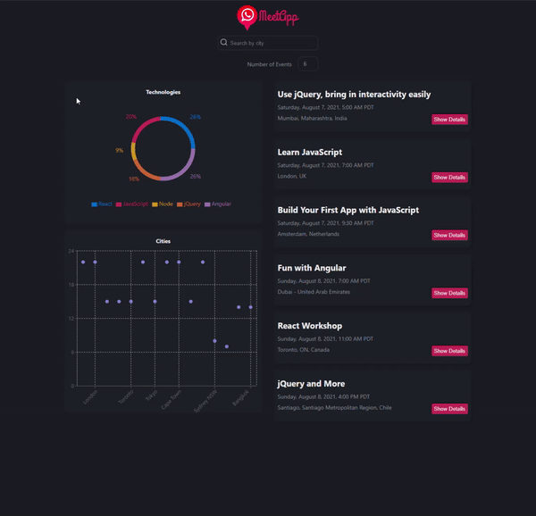

# MeetApp

[Link to Live Project](https://ryrojas.github.io/meetapp/)

A serverless PWA built on the Google Calendar API in React, using a test-driven development approach.

Serverless functionality hosted through AWS Lambda.

## Features
- User is able to filter events by city
- User is able to collapse and expand event details
- User is able to specify the number of events displayed
- User is able to use the app while offline
- User is able to install the app as a PWA on their mobile device
- User is able to view a breakdown of events by location and technology via data visualization

## Tech
- AWS
- Enzyme
- Google OAuth 2.0
- Google Calendar API
- Jest/Enzyme
- Puppeteer
- ReactJS
- Recharts

## Dependencies
- react
- react-dom/test-utils
- recharts
- enzyme
- axios
- nprogress
- @wojtekmaj/enzyme-adapter-react-17
- jest-cucumber
- puppeteer
- gh-pages
